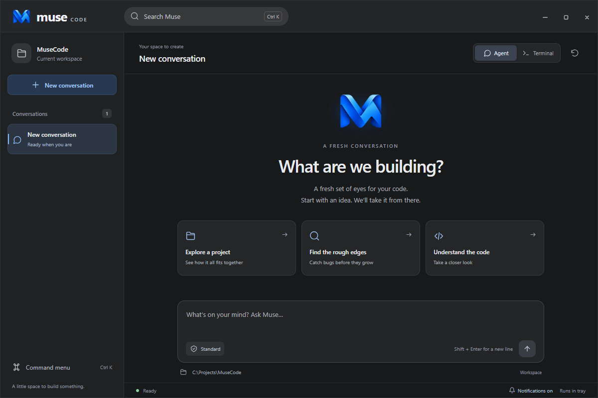
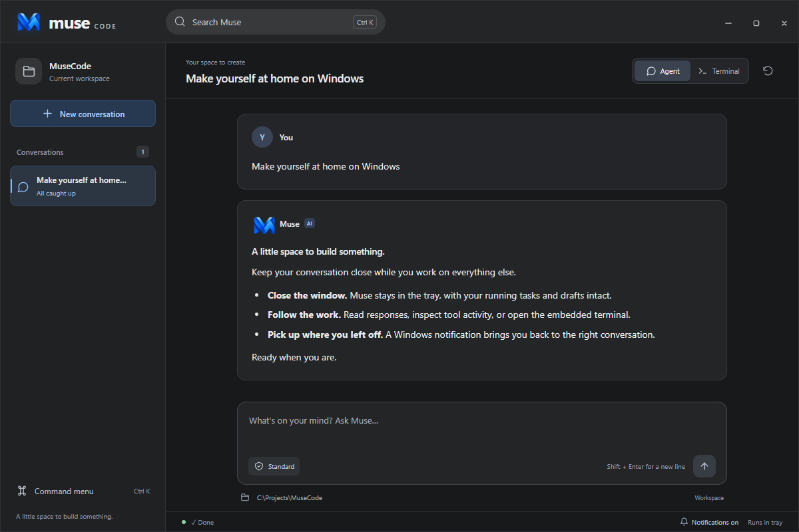
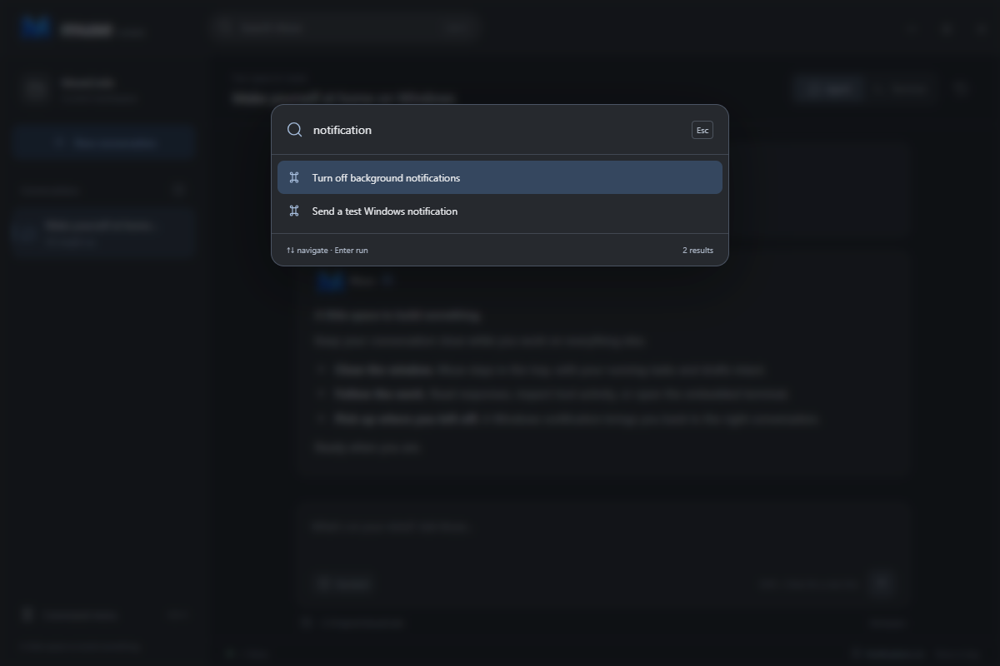
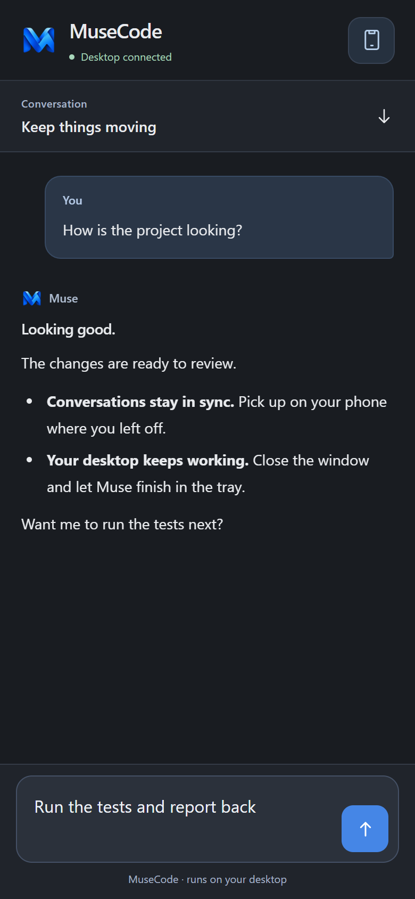

<div align="center">
  
  <h1>MuseCode</h1>
  <p><strong>Muse, with a home on your desktop.</strong></p>
  <p>A Windows desktop companion for the Muse CLI.<br />Created by <a href="https://github.com/velumix"><strong>Velumix</strong></a>.</p>
  <p>
    <a href="https://github.com/velumix/MuseCode/actions/workflows/windows.yml"></a>
    
    
    
  </p>
  <p>
    <a href="#get-musecode"><strong>Get MuseCode</strong></a> ·
    <a href="#why-i-built-it">The story</a> ·
    <a href="docs/development.md">Development guide</a> ·
    <a href="https://github.com/velumix/MuseCode/issues">Feedback &amp; ideas</a>
  </p>
</div>

<p align="center">
  
</p>

## Why I built it

I'm **[Velumix](https://github.com/velumix)**, and I built MuseCode because Muse only had a terminal version when I started this project.

I wanted a proper app: something that could live in the Windows tray, keep working after I closed the window, and send me real notifications when it was done. I also wanted a clean, minimal interface that felt good to use every day.

So I made it. **MuseCode is my desktop app around the Muse CLI**, with chat, an embedded terminal, background work, and native Windows notifications. The Muse CLI provides the coding agent; this repository is the desktop experience I built around it.

## Built for the way I wanted to work

| | What you get |
| :-- | :-- |
| **Close it. Keep working.** | Closing the window sends MuseCode to the tray. Running tasks, terminals, tabs, and drafts stay alive. |
| **Real Windows notifications.** | Background Agent turns notify you when they finish or fail. Open the notification to return to its conversation. |
| **Take the conversation with you.** | Pair your phone with a QR code, follow live Agent activity, send messages, and stop tasks through your private Tailscale connection. |
| **A quieter workspace.** | Charcoal surfaces, blue accents, readable conversations, and motion that respects reduced-motion preferences. |
| **See what the agent is doing.** | Streaming responses, Markdown and code blocks, tool activity, task lists, and visible errors. |
| **Chat and terminal, together.** | Every tab has an Agent view and an embedded terminal. Switching views preserves both. |
| **Pick up where you left off.** | Click the tray icon or open the desktop shortcut to restore the existing instance. |
| **Keep your hands on the keyboard.** | A command palette, session shortcuts, terminal search, and zoom controls. |

<table>
  <tr>
    <td width="50%"><a href="docs/images/musecode-conversation.png"></a></td>
    <td width="50%"><a href="docs/images/musecode-commands.png"></a></td>
  </tr>
  <tr>
    <td align="center"><strong>Space for the conversation.</strong></td>
    <td align="center"><strong>Your next action, a few keys away.</strong></td>
  </tr>
</table>

<p align="center"><sub>Actual app interface with sample content. Click a preview to see it at full size.</sub></p>

## Get MuseCode

**You'll need Windows x64 and a working Muse CLI installation.** The app uses the `muse` command already on your computer. Confirm that `muse --version` works in a terminal before launching it.

1. Open [Windows CI](https://github.com/velumix/MuseCode/actions/workflows/windows.yml) and choose the latest successful run.
2. Download **MuseCode-windows-x64** from **Artifacts** and extract the ZIP.
3. Run **Muse Code_0.2.0_x64-setup.exe**, then launch **Muse Code** from your desktop or Start menu.

CI artifacts require a GitHub sign-in and are retained for 14 days. These are unsigned development builds. Install the bundle so Windows can register the app's notification identity and click handler.

Prefer to build it yourself? See [Build from source](#build-from-source) below.

## At home in the tray

| Action | What happens |
| :-- | :-- |
| Close the window or press `Alt+F4` | MuseCode hides to the tray and keeps running. |
| Click the tray icon or launch the desktop shortcut | The same window, conversations, and drafts return. |
| Finish or fail an Agent turn while MuseCode is hidden, minimized, or unfocused | Windows receives a notification for that conversation. |
| Click a notification | MuseCode opens the matching Agent conversation. |
| Toggle the footer bell or tray notification setting | Notifications are muted or enabled; your preference is saved. |
| Choose **Quit Muse Code** from the tray or command palette | The app exits and stops its background work. |

Notification text keeps prompts, answers, and workspace details inside the app. Windows notification settings and Do not disturb still apply. Use **Send a test Windows notification** in the command palette to check your setup.

## Your desktop, from your phone

MuseCode includes a mobile interface you can add to your home screen. Your desktop runs
the agent; your phone shows the same Agent conversations and can send messages or stop work,
including while the desktop window is closed to the tray.

<p align="center"><a href="docs/images/musecode-phone.png"></a><br /><sub>Actual phone interface with sample content.</sub></p>

1. Install [Tailscale](https://tailscale.com/download) on your desktop and phone, and connect both to the same network.
2. In MuseCode, choose **Connect phone → Enable remote access**. Enable HTTPS in Tailscale if prompted.
3. Choose **Show pairing code**, then scan the QR with your phone camera.
4. Name the phone and confirm its matching code on your desktop. You can grant control or view-only access.
5. Add MuseCode to your phone's home screen from the browser menu.

The QR expires after two minutes and can be claimed by one phone. Paired devices appear in
**Connected devices**, where you can disconnect them. Phone logins expire after 90 days.
[Tailscale Serve](https://tailscale.com/docs/features/tailscale-serve) provides private HTTPS
on port **8443**; MuseCode leaves other Serve routes alone and does not enable public Funnel access.

Keep the desktop awake and MuseCode running. Phone controls currently operate on Agent
conversations opened on the desktop, using standard agent permissions. Terminal control,
phone push notifications, and creating workspaces from the phone are not included yet.
Reconnecting or refreshing the phone replays recent activity; quitting the desktop still
ends its sessions. See [remote access details](docs/remote-access.md) for setup and troubleshooting.

## A few shortcuts worth knowing

| Shortcut | Action |
| :-- | :-- |
| `Ctrl+K` | Open the command palette |
| `Ctrl+T` | Start a new conversation |
| `Ctrl+Tab` / `Ctrl+Shift+Tab` | Switch conversations |
| `Ctrl+1` … `Ctrl+9` | Jump to a conversation |
| `Ctrl+L` | Focus the message input |
| `Enter` / `Shift+Enter` | Send / add a new line |
| `Ctrl+F` | Search the terminal |
| `Ctrl+=` / `Ctrl+-` / `Ctrl+0` | Zoom the terminal in / out / reset |

## Build from source

Install Node.js 24, rustup, the Windows MSVC build tools, and the Muse CLI. The tested Node and Rust versions are pinned in [`.node-version`](.node-version) and [`rust-toolchain.toml`](rust-toolchain.toml).

```powershell
git clone https://github.com/velumix/MuseCode.git
cd MuseCode
npm.cmd ci
npm.cmd run tauri dev
```

Build and install the Windows bundle:

```powershell
powershell -NoProfile -ExecutionPolicy Bypass -File scripts/install.ps1 -Build
```

The app uses **Tauri 2 + Rust**, **React 19 + TypeScript**, and **xterm.js over Windows ConPTY**. Chat is driven by structured `muse exec --json` output. Tray lifetime and notification delivery run in the native backend.

See the [development guide](docs/development.md) for tests, native smoke checks, installer commands, and the project layout. The [QA report](docs/qa-2026-09-26.md) records the verified behavior and remaining work; the [brand notes](docs/brand.md) cover the logo and assets.

## Where it stands

Automated checks cover desktop and phone interactions, pairing and access controls, reconnects,
and the native agent runner. Windows smoke tests exercise tray behavior, notifications, and
process cleanup. [Windows CI](https://github.com/velumix/MuseCode/actions/workflows/windows.yml)
checks the code and builds the installer. The optional remote smoke test also exercises the
installed Tailscale connection; see the [development guide](docs/development.md).

There are still a few things I want to improve:

- **Save and restore sessions.** Tabs and drafts survive closing to the tray, but are still held in memory. Explicit Quit, crashes, and Windows restarts do not restore them yet.
- **Interactive approvals in chat.** Chat currently displays approval notices and auto-cancels interactive questions. The terminal is available for interactive workflows.
- **Easier project switching.** A folder picker, recent workspaces, and clearer project navigation are on the list.

Agent and Terminal are separate conversations within a tab. Terminal work keeps running in the tray, but completion notifications currently come from structured Agent turns. Changing a tab's workspace intentionally starts a fresh session.

---

<p align="center">
  Built by <a href="https://github.com/velumix"><strong>Velumix</strong></a>.<br />
  <sub>I wanted Muse to feel at home on my desktop. Now it does.</sub>
</p>
