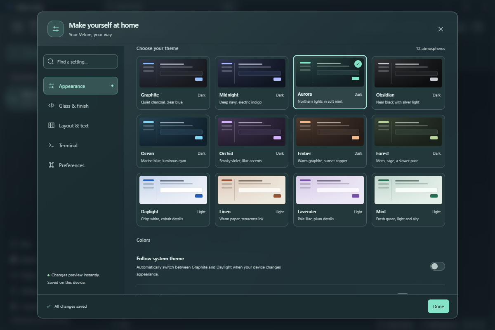

# Make Velum your own

Open **Settings** in the sidebar, press **Ctrl+,**, or search for settings in the command menu. Changes apply immediately and save on this device.

## Themes and color

Choose from twelve presets:

| Dark | Light |
| --- | --- |
| Graphite, Midnight, Aurora, Obsidian | Daylight, Linen |
| Ocean, Orchid, Ember, Forest | Lavender, Mint |

**Follow system theme** switches between Graphite and Daylight with your device. Accent, canvas, and surface colors can be customized separately. Text and action colors adjust for contrast; canvas and surface colors of similar brightness give the clearest results. Selecting a preset restores its colors and keeps your other preferences.

## Glass and finish

Start with **Frosted**, **Crystal**, or **Solid**, then adjust panel opacity, blur, saturation, ambient glow, grain, borders, shadows, and corners. These effects use the app's canvas. They do not require Windows desktop transparency. Reduced transparency on the device disables glass while preserving your selected profile.

## Layout and typography

Adjust interface density, sidebar style and width, conversation width and margins, interface font and text scale, message font, size and line spacing, and code font and size. Fonts use local fallbacks when unavailable.

You can hide conversation starters, keyboard hints, or message avatars; keep copy buttons visible; and reduce animation. The device's reduced motion preference is always respected.

## Terminal and conversation preferences

Terminal colors follow the theme. Text size, line spacing, cursor style, blinking, and scrollback can be changed while a terminal is connected. Its process stays connected and keeps output up to the configured scrollback limit; reducing that limit drops older lines. **Ctrl+0** restores the configured text size after a temporary zoom.

Choose **Enter** or **Ctrl / ⌘ + Enter** to send a desktop message, the initial display of tool output, and the provider for new conversations. Existing conversations retain their provider. Background notification controls use the existing Windows notification preference.

**Compact assistant controls** keeps model and provider choices behind **Assistant settings**. **Group agent activity** combines consecutive actions into an expandable summary, with failed or blocked actions visible while closed. Both default to on. Tool output preferences still control the individual actions inside an expanded group. See [the conversation guide](conversation-experience.md).

## Save, share, and restore

Desktop settings are stored atomically in `appearance.json` in Tauri's per-user application configuration directory. Browser storage is a secondary cache. A save failure remains visible in Settings with a retry action.

Export a JSON settings profile, import it on another device, or restore defaults under **Preferences**. Imports accept version 1 profiles up to 32 KB. Unknown properties are discarded; invalid options use defaults; numeric controls stay within their supported ranges. Profiles contain appearance and conversation preferences. Notification settings remain managed by the native desktop service.

On a phone, open **Phone settings → Appearance & preferences**. This profile stays in that phone browser, including when access to the desktop is view only. Enter inserts a new line on the phone; Send or Ctrl / ⌘ + Enter sends the message.
