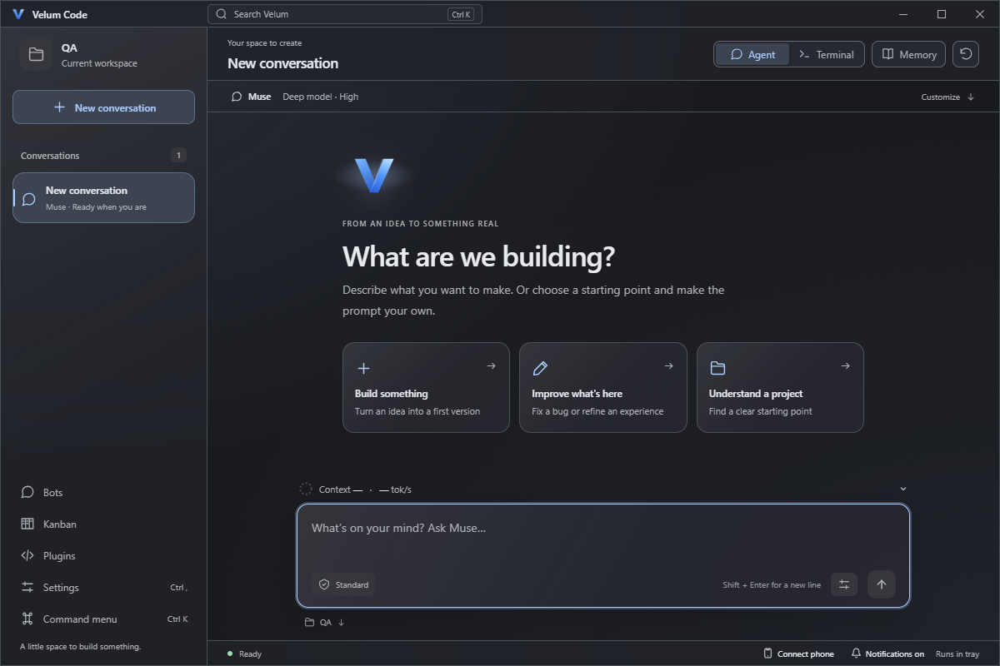
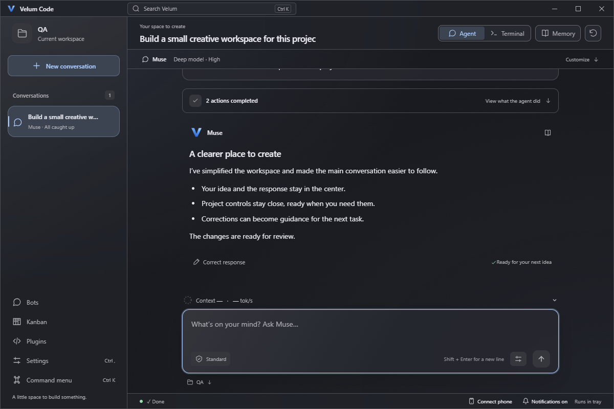

# Focused conversation experience QA

Date: 2026-09-30. Local Windows update based on the queue and provider metrics fix, on branch `improve/focused-conversation-ux`.

## Findings and changes

| Finding | Change |
| --- | --- |
| Provider, model, reasoning, bot, and workspace controls competed with the conversation. | A compact assistant summary and project-folder disclosure keep those controls accessible when needed. Existing authentication and invalid-folder recovery remain visible. |
| Tool logs and heavily framed answers competed for attention. | Consecutive actions share a quiet expandable summary. Answers have an open reading surface; failed/blocked actions remain visible while closed. Stopped activity has a neutral label. |
| Starters submitted generic requests immediately. | Three creation-oriented starters prepare editable drafts, preserve existing text, and wait for Send. |
| Correcting an answer offered no direct reviewed lesson flow. | Inline corrections preserve the composer draft and can queue behind active work. An optional reviewed lesson becomes an active, pinned project note. |
| A partial send/save failure could invite duplicate work. | A failed send retains edits and saves no lesson. A failed save after sending retries only the save. Matching notes retain their identity. |
| Pending memory suggestions were difficult to discover. | Memory displays a pending count and opens directly in Review. The agent can suggest lessons from user-confirmed corrections, with errors alone excluded. |
| An expanded phone settings row crowded short screens. | Short portrait layouts reduce spacing while retaining touch targets. Landscape assigns the whole settings disclosure to its grid cell; very short keyboard viewports retain the composer. |

The changes use the existing theme/glass preferences and local Markdown vault. Compact controls and activity grouping can be turned off under Settings > Preferences. Phone devices with view-only access have no correction actions. See [the conversation guide](conversation-experience.md).

## Validation

- `npx.cmd playwright test --reporter=line`: **146 passed** in the final full run, including correction queueing for all providers, partial-save recovery, draft preservation, Unicode title limits, disabled memory, reviewed suggestions, adjustable activity/controls, light glass, and phone permissions.
- Rust: `cargo test --locked --lib -- --quiet` passed **158 tests**, with the existing opt-in GitHub-download test ignored.
- `cargo fmt --all -- --check`, `cargo clippy --locked --all-targets -- -D warnings`, and the SDK scaffold test passed.
- `npm.cmd run tauri -- build --bundles nsis` passed, including TypeScript and the embedded desktop/phone production frontend.
- `node scripts/native-smoke.mjs --release` passed with real WebView2, Tauri IPC, local provider executables, stdin, and ConPTY. Muse, Codex, and Antigravity each exercised correction sending, draft preservation, project lesson save, idempotent retry, and actual lesson text in the following provider input. New provider conversations also recalled the reviewed Muse lesson.
- `node scripts/native-smoke.mjs --installed` passed the same complete checks on the installed executable, including all three providers' corrections, queues, and future-turn lesson recall.
- Native regression checks cover all three queues, process-exit ordering, Stop/failure retention, numeric usage and tok/s, model/reasoning controls, memory budgets, workspace validation, preferences, recovery, tray behavior, login fixtures, and owned-process cleanup.
- `node scripts/remote-smoke.mjs --release --usb-fixture` passed against the real native HTTP server and authenticated phone browser. It includes a phone correction, preserved draft, pinned project lesson, and future native recall, plus existing pairing, private-data cache exclusions, queue controls, Standard permissions, recovery, bots, Kanban, disconnect/reconnect, and revocation.
- The installed-phone rerun stopped at USB discovery: Windows Application Control blocked its newly compiled ADB fixture (`os error 4551`). This is a test-helper execution limit. No Windows policy was changed or bypassed. The packaged-phone check above passed, and the installed payload was compared with that tested executable as described below.

Native checks use isolated settings, projects, provider data, and WebView profiles and refuse to attach to an existing Velum process. Providers and USB discovery/forwarding use deterministic local protocol fixtures; this update does not claim a new live-model or physical-Android check. Learning supplies reference notes to future provider input; it does not train a model or guarantee instruction-following.

## Visual review

Screenshots use local UI fixtures. Desktop welcome and answer hierarchy, desktop correction forms, light Crystal glass, and phone corrections were inspected. Automated accessibility checks cover focused defaults, correction forms, dark/light themes, and phone controls. Responsive checks cover the minimum desktop window, narrow phones, portrait keyboard sizes, and landscape.

## Installation

The focused-experience update is installed at `C:\Users\c0dec\AppData\Local\Velum Code\velum-code.exe`. The organized Desktop launcher points there. Its installer and optimized executable are archived in `Desktop\Velum Code\Builds\Windows\2026-09-30-focus`, alongside the earlier updates.

| Artifact | SHA-256 |
| --- | --- |
| NSIS installer | `1A6B7485B67060937C85D39D3E7043F908A6FC59D168FB383614425210BF0476` |
| Optimized executable | `253E0D1B0A5F415DF5BCA6AD90BAA67E97FA44659ECC788832826C6DAA5C2ADC` |
| Installed executable | `838F9D127CD6D6CA9C2F779CCF732A3B5A95444D31D62543D9E1404C038AC269` |

An in-memory comparison verified that the installed payload differs only in Tauri's three-byte NSIS bundle marker. No executable was modified for verification. The installer-created duplicate loose Desktop shortcut was removed after confirming that it and the organized launcher target the installed executable.

Source and companion repositories remain separate. Work remains local on the named branch.
